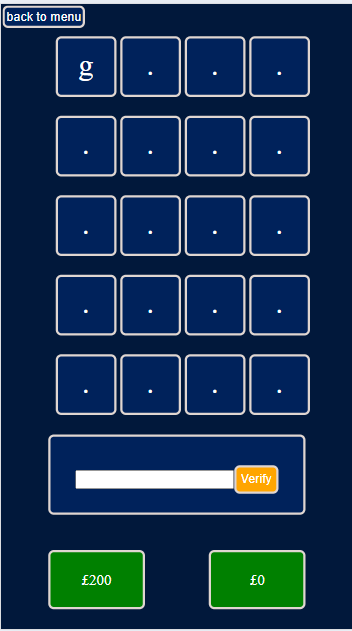

# Lingo Practice Game 

The Lingo Practice game is a word game inspired from the uk TV show Lingo.

The game allows users to play the exact game seen on tv and see how much money they could get in the hit TV show.

The game also offers practice rounds for each letter length 

The game can be used for recreation and learning. 

Indviduals that are going to go onto the show can use the game as practice as the rounds are Identical.

The game can also be used by people learning English or people who want to increase there vocabulary as it has an inbuilt dictonary system that the user can save the Lingo words that have been generated and look back on these with there definitions

There are other games that use this similar format for a game such as woordle, however i see that there are no others that follow the format of the popular TV with the same scoring and game format such as the Challenge questions or final.

The Live link can be found here [LingoPractice](https://ethantrout.github.io/Lingo-practice/)
Note: you will need a words API key to play. see Deployment section on how to get one


# Site Owner Goals
- To create a visually apealing site that is easy for users to navigate 
- To have a functional Lingo game that accurately follows the the logic in the Tv show 
- To have customiseable practice runs for the player to choose the settings
- To entice to user to return to the game to get a better score or practice words of different lengths

# User Stories

- ## first time user
    - As a first time user i want to be able to easily understand how to play the game.
    - As a first time user i want to be able to easily naviagte the menu and start a game or practice round.
    - As a first time user i want to be able to easily select settings for the game or practice round.
    - As a first time user i want to have fun and get a score for how well i have done. 

- ## Returning user
    - As a returning user i want to be able to be able to play the game again without getting the same words as before.
    - As a returning user i want to be able to save my score to the leaderboard and view my scores.
    

- ## Frequent user
    - As a frequent user i want options to make the game more difficult by playing a timed version of the game.
    - As a frequent user i want to be able to beat my highscore on the leaderboard
    - As a frequent user i want to be able to save words that i like to my personal dictionary

# Design
## Imagery 

- The imagery in the game were given carful consideration. i wanted the game to feel as if the player is on the TV show lingo and therefore used a similar color scheme to that on the show.

### color scheme


The color pallet has high contrast and makes it easy for a user to determin a correct answer and incorrect answer. 


## Layout 
The a site has single page with 4 sections 

- The Tutorial section (links to new page)
    - Runs through the game rules
    - displays the game board and explains what each element does

- The full game area 
    - Displays the game area
    - Displays the selection for final rounds
    - Displays the Game over screen
    - Displays the add to dictionary section on the game over screen

- The Settings section 
    - Displays The Main game settings- timed or untimed
    - Displays the Practice game setting- word length, guesses and round length.

- The leaderBoard section
    - Displays the leaderboard

- The Dictonary Section
    - Displays the user added words and there descriptions

## wireframes

<details>

 <summary>Desktop Wireframe</summary>


 </details>

 <details>
    <summary>Mobile Wireframe</summary>


 </details>

Orginally i did not conceive of a Dictonary Section but when working with the API i realised there was a way to allow the game to be more educational and reach another set of users. Indviduals that are trying to learn English or increase there vocabulary

equally i did not conceive of having two main game modes. timed and untimed as the show only has timed games. However from play testing i realised that the timed game modes are much harder. In the game show you say the word aloud but in this game you have to type it in which makes it much more difficult

# Features

## Homepage 

The Home page is the Game menu. The user will come back to this page at the end of every game. The user can choose from 4 interactive buttons that are:
- How to play
- PlayLingo
- Practice
- LeaderBoard
- Dictonary


You can see here the inspiration for the look and feel of the Website comes from the Orginal Tv show


## Tutorial page
- The Tutorial page is a menu. the player can choose between 3 interactive buttons that are:
- Game play
- Challenge words
- Final 


### Tutorial sections
All sections work the same.
- show an image of the board 
- followed by a set of instructions/ tasks 
- buttons to move to the next display or exit 


## Play Lingo


- When the user clicks this button the game becomes occupied with two options. Timed and untimed.
    - This allows the user to decide a diffculty. its much harder when every answer needs to be made quickly!


### The board
- a back button allows the player to exit the game 
- A board is created and a new Lingo word is generated for the player to guess. This will be new everytime
- The player has 5 guesses and therefore 5 rows of boxes are shown.
- The first letter of the Lingo Word is given to the player 


#### Timed board
- when a game is timed a progress bar is shown for each answer.
- the player has 10s to enter there answer or the round will end and the next one will start


### User input
- A box under the board is highlighted and is where a user can enter the word. they can click verify or enter to guess
- to the left of this box the money increment is displayed. the player will get this money if they guess correctly
- to the right of this box the players gained money is displayed


#### User input mobile
- On mobile the increment and player money are moved under the user input for a better UI experience

Note: this is done via JS not CSS when a game is started so will not be visible if game is started and Dev tools are used to decrease the screen width



### GamePlay 
#### Player input
- When the user guesses a word is it displayed in the row they are on.
- The game Highlights any letter in the correct place as green.
- the game Highlights any letter that is correct but in the wrong place as being orange.
- the round then moves down to the next set of gueses 

Note: word is Bias


#### Player Input incorrect 
- if the word is not a word or the player is out of guesses then the game will display the tiles as red and show the Lingo word in the next set of tile 
- If there are not any tiles left it will create them 
- The user input area will hide its self to stop the user from entering another word


#### Player Input correct 
- if the guess is correct the tiles will animate and show all tiles as green before moving onto the next game.
- The user input area will hide its self to stop the user from entering another word


### Challenge rounds
- a challenege round is timed 
- the money decreases with each letter given.
- The player only gets one guess
- a clue is given to the player


### New Game stage display
- After entering a new stage of the main game a display will apear highlighting the new stage
- It displays the stage and how much money the player has
- this will apear for 5s before moving onto the game

### Game Structure 
The game structure is the same as the TV show Lingo. all rounds Except Challenege rounds get five guesses

- Stage 1: 4 letter Lingo word. 4 games worth £200 each. 
- Stage 2: A Challenge Lingo round 9 letter word.
- Stage 3: 5 letter Lingo word. 4 games worth £300 each.
- Stage 4: A challenege Lingo round. 10 letter word.
- Stage 5: 4 letter Lingo Word. 2 games starting at £500 but decreases by £50 each guess
- Stage 6: 5 letter Lingo Word. 2 games starting at £500 but decreases by £50 each guess
- Stage 7: A Challeneg round 10 letter word
- Final: The user gets 90 sections on the clock. They must answer a 4 letter word and a 5 letter word. They can skip each word and the game will only end when the timer runs out.
    - 4 letter win: the player gets half of there money 
    - 5 letter win: the player banks all of there money and can move onto next round
- User Choice: the user can choose to play: 
    - a 6 letter lingo with the remaning time. doing so they can bank there current money. and if they win double it. 
    - a seven letter lingo with the remaning time. doing so they risk there current money but could win £1500.
    Note: the user can not skip the 6 letter or 7 letter


### Game over 
The game over screen displays the players Total money earned and time remaning if any.

The player can enter there Name to save a highscore. this will redirect to the main menu

The player can also check all the lingo words that were given to them in the game.


#### All Lingo words 
- when the player clicks this button it displays a list of the lingo words from all Stages. with a Add button
- when the player clicks on a word it will display its decription
- when the player clicks add it will remove the word from the list and add it to there Dictonary on the home screen
- the section includes a back button to go to the previous menu to update there score


## Practice 
This section displays setting for a practice round. allowing the user to set the word length. how many guesses. and how many total rounds 


### Practice game play
Practice game play is the same as the main lingo game without different rounds. the user sets these indvidualy. 

### Game over 
The game over screen will display how many you got correct out of the total rounds. 

Note:You can not save scores for practice rounds 


## LeaderBoard 
- The leaderboard section displays the 5 highest score both for Timed Gamed and Untimed Games


## Dictonary 
- The dictonary Displays the words added by the user at the end of each lingo game 
- A scroll is in built so the words remain within the container


# Testing

## validator testing

- HTML
    - No errors were found when passing through the offical W3C markup validator
    - [W3C Validator results](https://validator.w3.org/nu/?doc=https%3A%2F%2Fethantrout.github.io%2FLingo-practice%2F)

- CSS
    - No errors were found when passing through the offical W3C markup validator
    - [W3C Validator results](https://jigsaw.w3.org/css-validator/validator?uri=https%3A%2F%2Fethantrout.github.io%2FLingo-practice%2F&profile=css3svg&usermedium=all&warning=1&vextwarning=&lang=en)

- Javascript 
    - No Major errors were found when passing through the offical JSHint validator
    


## Input testing 
- The player input word is validated to only accept letters and only begin with a letter that is the same as the lingo word 
- Username input when adding to score is validated to only accept letters and no spaces.

## Manual and Automatic testing
- I Mainly used Automatic Testing as my knowledge of Automatic testings is only small. I have documented all my of own manual testing in the document linked. 

- The main core logic behind the lingo game was developed and tested at the very beginning of the project. before anything was displayed. i realise in hinesight that i could of used Jest to automatiicaly test the inputs and outputs and it would have saved me alot of time refactoring the code. You will see in the Testing document that i refactored the VerifyAnswer function many times to get the desired out.

The reason i manually tested VerifyAnswer was because i set the outputs to be visual. setting the tiles green or orange. Had i of created an array to store these outputs i could of more easily tested this with JEST

[Testing Document](TESTING.md)
## User Testing

## Bug fixes
alot of major bug fixes to the Core functionality of the lingo game are on the supporting Testing Document but will highlight some of the bugs i faced here.

### Verify Answer setting tiles orange and green
I had alot of issues with the core verifcation. and refactored the code multiple times when encountering new issues.

#### first bug - Excert from Testing Documet 

- set tile orange doesnt currently only tests for if the current tile is not green. 
- the function is not testing for if the letter is already green in another tile and the letter isnt repeated and therefore the letter does not need to be set to orange.

- word: Step
    - 

- word: Dart
    - 


##### Previous code in VerifyAnswer function

```javascript 
else if(gameController.userAnswer != gameController.lingoWord){
        for(x =0; x<gameController.userAnswer.length;x++){
            var letter = gameController.userAnswer[x]
            if(letter === gameController.lingoWord[x]){
                setTileGreen(x);
            }
            for(y=0; y<gameController.lingoWord.length;y++){
                if(letter === gameController.lingoWord[y]){
                    setTileOrange(x);
                }
            }
        }
        document.getElementById("user-answer").value =""
        gameController.roundTiles[gameController.roundCounter][0].innerText = gameController.lingoWord[0];
        gameController.roundCounter++;
    }
```

##### Fix 

```javascript 
else if(gameController.userAnswer != gameController.lingoWord){
        for(x =0; x<gameController.userAnswer.length;x++){
            var letter = gameController.userAnswer[x]
            if(letter === gameController.lingoWord[x]){
                setTileGreen(x);
            }
            for(y=0; y<gameController.lingoWord.length;y++){
                if(letter === gameController.lingoWord[y]){
                    if(gameController.roundTiles[gameController.roundCounter][y].style.backgroundColor !="green")
                    setTileOrange(x);
                }
            }
        }
        document.getElementById("user-answer").value =""
        gameController.roundTiles[gameController.roundCounter][0].innerText = gameController.lingoWord[0];
        gameController.roundCounter++;
    }
``` 
The for loop checks to see if the letter is found elsewhere in the lingoWord. the index for this is Y
Because the lingoWord and the tiles will always be the same length we can use the index of the found lingoWord letter to also check to see if that letter has already been found and set green.


This has created a new issue that the code will only work if the letter is after the orange one:


This is easily fixed by turning all the tiles green before checking if the tiles need to be made orange

```javascript 
else if(gameController.userAnswer != gameController.lingoWord){
        for(x =0; x<gameController.userAnswer.length;x++){
            var letter = gameController.userAnswer[x]
            if(letter === gameController.lingoWord[x]){
                setTileGreen(x);
            }
        }
        for(z =0; z<gameController.userAnswer.length;z++){
            for(y=0; y<gameController.lingoWord.length;y++){
                if(letter === gameController.lingoWord[y]){
                    if(gameController.roundTiles[gameController.roundCounter][y].style.backgroundColor !="green")
                    setTileOrange(z);
                }
            }

        }
}
```

#### Second Bug Excert from Testing Document
- set tile orange will still trigger if the user enters two letters and one should be orange. it makes both orange

##### Examples


##### Fix
- I need to find a way to store the letter and its index if it is being turned green or orange 

###### Sudo Code
Object{W:0 O:1 R:2 D:3}

loop user-answer letters
if letter index = key and letter = key
remove key and value 
set tile green

loop user-answer letters
if letter is in Object 
find object key 
remove key and value 
set tile orange

- i created the object with indexs 

```javascript
lingoLettersAndIndex ={};
    for(z=0;z<gameController.lingoWord.length;z++){
        lingoLettersAndIndex[z] = gameController.lingoWord[z]
    }
```

- i didnt need to search the obj for Green letters as they needed to have the same index so i stuck with the previous loop

```javascript
for(x =0; x<gameController.userAnswer.length;x++){
            var letter = gameController.userAnswer[x]
            if(letter === gameController.lingoWord[x]){
                delete lingoLettersAndIndex[x]
                setTileGreen(x)
            }
        }
```
- the orange tile was harder as i needed to check if it was contained in the object with

```javascript
Object.values(lingoLettersAndIndex).includes(letter)
```

- i searched online for how to find a key from its value in an object and found this on stack overflow
[stackoverflow][https://stackoverflow.com/questions/9907419/how-to-get-a-key-in-a-javascript-object-by-its-value]

```javascript
Object.prototype.getKeyByValue = function( value ) {
    for( var prop in this ) {
        if( this.hasOwnProperty( prop ) ) {
             if( this[ prop ] === value )
                 return prop;
        }
    }
}

var test = {
   key1: 42,
   key2: 'foo'
};

test.getKeyByValue( 42 );  // returns 'key1'
```

using this i could complete the function 

###### Refactored code
```javascript
else if(gameController.userAnswer != gameController.lingoWord){
        
        for(x =0; x<gameController.userAnswer.length;x++){
            var letter = gameController.userAnswer[x]
            if(letter === gameController.lingoWord[x]){
                delete lingoLettersAndIndex[x]
                setTileGreen(x)
            }
        }
        for(z =0; z<gameController.userAnswer.length;z++){
            var letter = gameController.userAnswer[z]
             if(Object.values(lingoLettersAndIndex).includes(letter)){
                for( var prop in lingoLettersAndIndex ) {
                    if( lingoLettersAndIndex.hasOwnProperty( prop ) ) {
                         if( lingoLettersAndIndex[ prop ] === letter ){
                            delete lingoLettersAndIndex[prop]
                            setTileOrange(z)
                            break;
                         }
                    }
                }        
                
             }

        }
        
        document.getElementById("user-answer").value =""
        gameController.roundTiles[gameController.roundCounter][0].innerText = gameController.lingoWord[0];
        gameController.roundCounter++;
    }
    
```
### API bugs
I had issues with the API when querying for longer Lingo words retuning words with spaces inbetween

i then had to create a loop in the GenerateLingo function to check for empty char spaces and call the API again until a word without this was shown

#### bug with getNewWord - Excert from Testing Document
As the player can only input the exact amoung of letters as there is tiles. words coming back from the api with a space beween were making them un winable Lingos. 

By adding a while loop to GenerateLingo function we can use the IndexOf(" ") to determine if a word has a space and if it does then generate a new word. This can make the inital load take longer so i have also asked on the WordsAPI forumn if there is a modifier to the inital call to make sure only a single word is given back. but until i get an answer this fix works 

#### fix
```javascript
async function GenerateLingo(){
await getNewWord()
while(gameController.lingoWord.indexOf(" ") != -1){
    console.log(gameController.lingoWord)
    await getNewWord()
}
 ```

 - 

 #### Mobile text box behaviour 
 I have had feeback from users that on mobile screens when entering text into the text box the browser will zoom in and scroll down. this means the player cannot see the lingo word being entered when submiting the answer and they have to scroll back up to the top of the page.

##### fix
 I have modified it so that when a user submits there answer the page scrolls back to the top of the page. 

 Users have reported that this change is much better.

## Known bugs

#### Fetch Default behaviour 
 
 The checkWord function validates if the word the user enters is a real word in the dictonary.

 it does this by fetching the WordsAPI with the word and if a 404 is given then it is known that the word is not in the dictonary. this is then handeled by alrting the user by ending the round.

 The default behaviour of a fetch will always log the 404 status to the console. i have tried many things to stop this behaviour but it is a brower behaviour and cannot be modified by the Javascript. This could be handeled by the server rather than the client side but this project is only CSS HTML and JS.

Note: this doesnt cause a bug with the game at all as the 404 is handled but displaying the 404 is not desired.
 

# Acessibility

## Lighthouse score 
- The site achieved a Lighthouse accessibility score of 100% on both mobile and desktop which confirms that the colours and fonts chosen are easy to read and accessible


### Browser Testing
- The Website was tested on Google Chrome, Firefox, Microsoft Edge, Safari browsers with no issues noted.
    
### Device Testing
- The website was viewed on a variety of devices such as Desktop, Laptop, iPhone 8, iPhoneX and iPad to ensure responsiveness on various screen sizes. The website performed as intended. The responsive design was also checked using Chrome developer tools across multiple devices with structural integrity holding for the various sizes.


# Technologies used
## Languages 
- HTML5
- CSS3
- JavaScript

## frameworks -libraries - API - programs Used
- Chrome dev tools- used for overall development and testing, including responsivness and preformance
- GitHub -Used for version control and hosting of the page
- W3C -used for validation testing of HTML and CSS
- WordsAPI - used for Getting random words, checking words exist and generating definitions for player dictonary
- ChatGPT3 - used for generating the 9 letter and 10 letter lingos along with clues 

# Deployment
## The site was deployed using GitHub pages. The steps to deploy using GitHub pages are:

1. Go to the repository on GitHub.com
2. Select 'Settings' near the top of the page.
3. Select 'Pages' from the menu bar on the left of the page.
4. Under 'Source' select the 'Branch' dropdown menu and select the main branch.
5. Once selected, click the 'Save'.
6. Deployment should be confirmed by a message on a green background saying "Your site is published at" followed by the web address.

The Live link can be found here [LingoPractice](https://ethantrout.github.io/Lingo-practice/)

## The API key was generated using WordsAPI. the steps to get a key are
1. Go to wordsapi.com
2. Go  to 'pricing' near the top of the page
3. Sign up for free using rapidAPI
4. Enter personal details
5. click generate API key 

Note: You can put your API key into the variable apiKey and the game should now run

## Cloning
To clone this repository follow the below steps:

1. Locate the repository at this link [Lingo Practice Repository](https://github.com/EthanTrout/Lingo-practice).
2. Under 'Code', see the different cloning options, HTTPS, SSH, and GitHub CLI. Click the prefered cloning option, and then copy the link provided.
3. Open Terminal.
4. In Terminal, change the current working directory to the desired location of the cloned directory.
5. Type 'git clone', and then paste the URL copied from GitHub earlier.
6. Type 'Enter' to create the local clone.

Note: you will need to generate your own API key for the game to work

# Features left to develop 
As the scope of this project is quite large and i had a deadline as this is being done as project 2 of the code insitite course. There are some features left that i would still like to add before taking this game public

## Challenege word practice
I did not add a section for practicing the challenege words as i have generated all the challenge words and clues using chatGPT. i have included a limited amount just due to time inputting into chatGPT and the costs accosiated. 

there are about 200 challenge words with clues for each 9 letter and 10 letter words. This works for the main game as you only encounter 4 total in each game. however putting this into a practice mode would soon have the words repeating

Currently the challenege words are just stored as a const but if i was to develop this further i would create an API with thousands of these words and clues. that the game could call for better repeatabillity

## Online mulitplayer
I brought up this idea when first concerptualising the game as the TV show has multiple players and each player can buzz in to steal others lingowords if they have got it incorrect.

This feature would make the game more replayable as people compete against others online

i was not able to implement this for the scope of this project but if i was to continue or another developer was to pick this up this would be some of my ideas of implementation

### GamePlay
All these games would follow the timed lingo game i have implemeted however this would now become turn based

3 players would wait for there indivdual go as they watch the other compete 

as i have set up stages for each lingo round this would invove player 1 playing stage 1. if an answer is incorrect then the other players would have an opptuninty to hit a key and the first person that clicked would get an opptunity to steal the answer adding to there total money.

once stage 1 is complete for player 1, player 2 starts and so on

The final would only then initalise for the player that has the most money

### LeaderBoard 
with the online leaderboard this would change to total money earened over there entire time playing. 

this would insentivise players to return 

### Montisation
A item/skin system could be implemted with different challeneges or achievements that grant skins or items

equally the player could be allowed to watch an add to skip a word or guarantee a steal 

this could be used via ads or items that a player could purchase

# Credits

## Content 
The inspiration for this game came from the UK tv show Lingo. This tv show is always on at my work and there have been multiple occasions where people have said they would love to see how well they would do on this show. There are other apps such as wordle that allow you to play but none that are accurate to the Shows game mecanics and can actually score you on this.

You can watch this TV show on ITV Player [Here](https://www.itv.com/watch/lingo/10a0540/10a0540a0107)

## Resources used 
- [Stack overflow](https://stackoverflow.com/)
- [obfuscator](https://obfuscator.io/) for API key
- [WordsAPI Docs](https://www.wordsapi.com/docs/)
- RegX learned about through this article [geeksforgeeks](https://www.geeksforgeeks.org/javascript-program-to-check-if-a-string-contains-only-alphabetic-characters/)

